= Domain Centric

https://www.youtube.com/watch?v=co3acmgP2Ng&t=1476s

https://odrotbohm.de/

https://odrotbohm.de/2023/07/sliced-onion-architecture/

https://odrotbohm.de/2025/11/jmolecules-2.0-stereotypical/

== Cost

Cost of Software = Cost of Change
Cost of Change = Coupling

Not all coupling is born equals (Adapter less coupling)

Cohesion is coupling in the right places

== Summary about system design

Software design is the act of modeling **units of strong cohesion**,**loosely coupled** to each other.

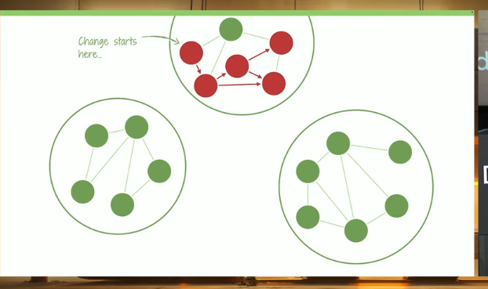

QUOTE: A software system's structure is essentially a formalized bet on change patterns you anticipate having to deal with the futures.

QUOTE: A system is never the sum of its parts, it's the product of their interactions. Russel L. Ackoff

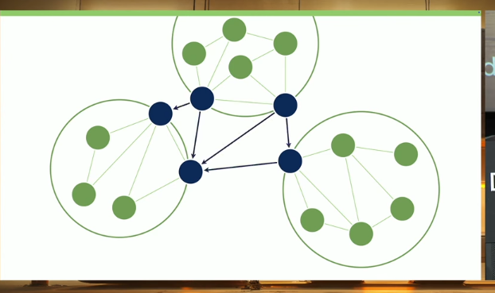

== Separation of Concerns Architectures

=== Hexagonal Architecture 2005 Alistair Cockburn
Application core surrounded by adapters

Fundamental ideas : adapters implement explicit designed ports

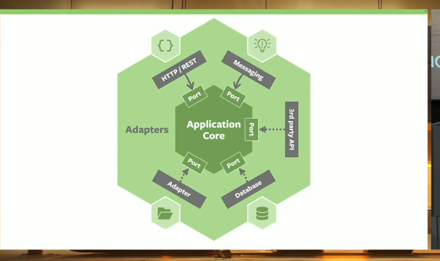

=== Onion Architecture 2008
pretty similar

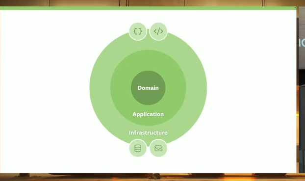

=== Spring application 2000 - 2006 : layer application

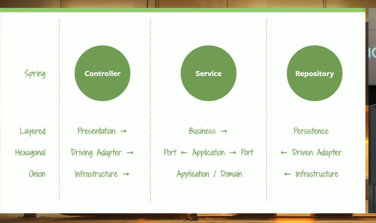

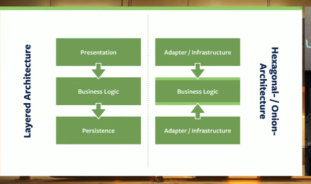

Hexagonal / Onion architecture same than Layered Architecture except that interfaces are used and dependencies inverted

== Goals and Effects

early 2000 application server, EJB, servlet ...

Testability was a problem

Easier when using Spring du to dependency injection with interfaces. Used mocked interfaces to write unit test and others. Use Test application framework to bootstrap an application context on your machine.

Technology-Free Domain

use interface and specific implementation likes a repository using jdbc next replaced by mongo.

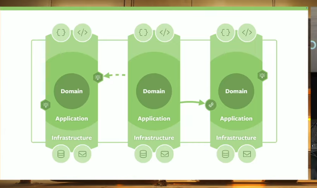

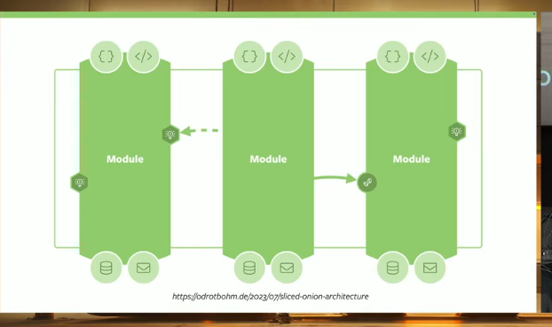

=== Code structure

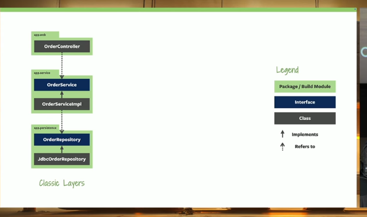

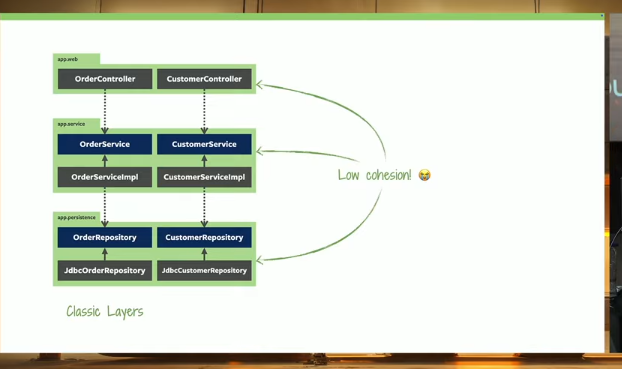

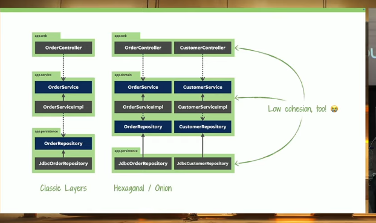

image::image-2025-12-14-23-27-51-713.png[]
in blue classes are public

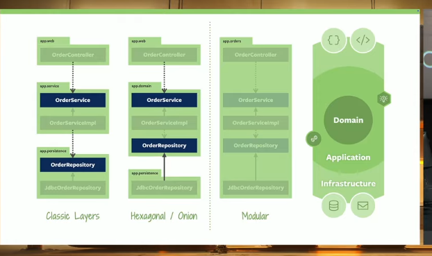

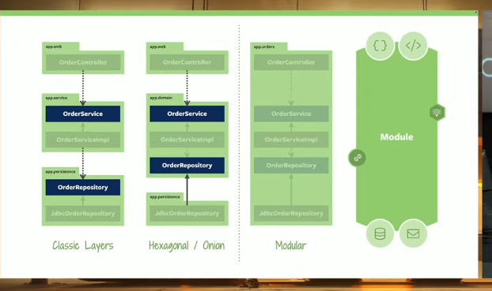

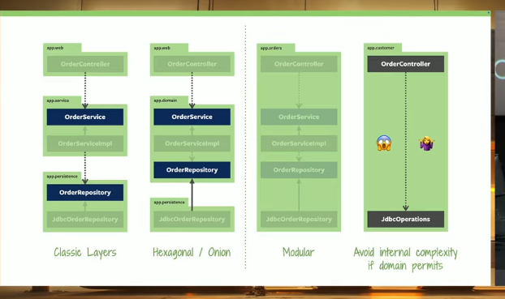

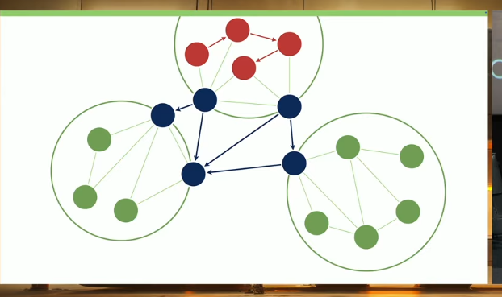

QUOTE: The primary objective of system decomposition is to support change. To contain the effects of a change to as few as possible elements. If your decomposition strategy does not align with that, it's distracting at best and harmful at worst.

== Strategic consideration

Functional Decomposition over Technical Decomposition
Intrinsic Complexity determines Accidental Complexity
Encapsulation over Organisation

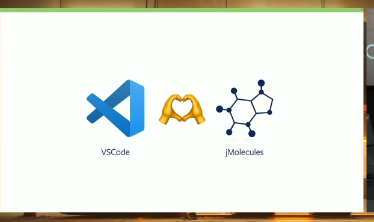

https://www.youtube.com/watch?v=7ZXW_oWdTk4

Cons: hexagonal / onion architecture
1. Feature spread across code base
2. High coupling between features
3. Unnecessary complexity

1. Maximizes cohesion between a slice (Regroup all code related to a feature in a slice)
2. Minimize coupling between slices
3. Avoids unnecessary abstraction

Adapters inbound and outbound are inside the slice.

Inbound adapters likes rest endpoint do not implement interfaces because they are the entrypoint.

Outbound adapters likes database implements an interface (abstraction) from the domain.

== Communication between slices

1. Event likes jakarta one
a slice send an event another one listen to it - solution preferable - fire and forget

2. Need to have a synchronous response
Expose an interface (a facade one)
The consumer inject the interface (aka facade)
Methods return projection / DTO but never the domain or an entity.
This is synchronous reading.

The feature consuming another feature must not
- inject an interface from the other slice likes a repository interface (high coupling)
- inject an adapter from the other slice likes a repository implementation (adapter)
- call a method on another slice domain

== To sum up:

A slice is a self-contained business capability, owning its domain model, its persistence, and its interaction points, and communicating with other slices only through explicit contracts or events.

A slice:
- Can evolve independently
- Has its own data
- Expose a clear API
- Can be tested in isolation
- Could become a microservice

- Asynchronous reaction : domain events (Event triggered by domain - framework less - likes a ThreadLocal managing a list of events from the domain)
- Technical orchestration : Applicative events (Event javax framework)
- Synchronous reading: applicative facade
- Logical sharing: NEVER

Application using Asynchronous events can be split into microservices communicating with kafka for example

Use jMolecules (https://github.com/xmolecules/jmolecules) to document, validate implementation structure. Can use ArchUnit rules to enforce slice architecture is well respected.
